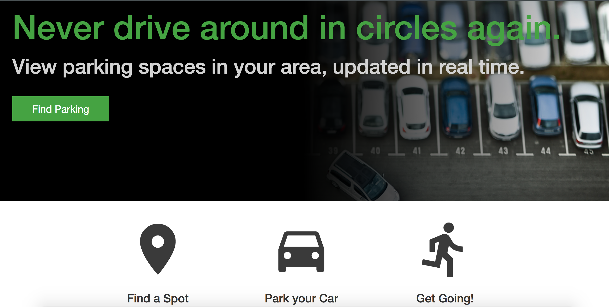
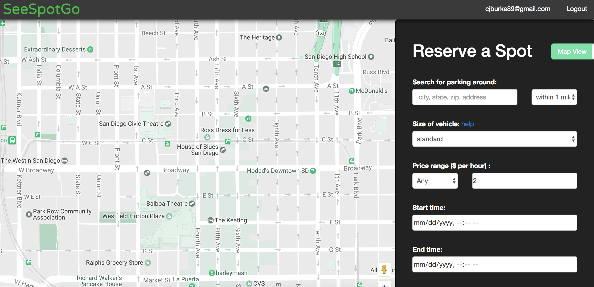
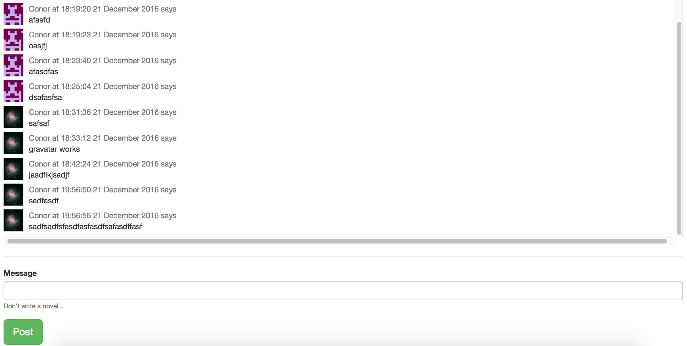
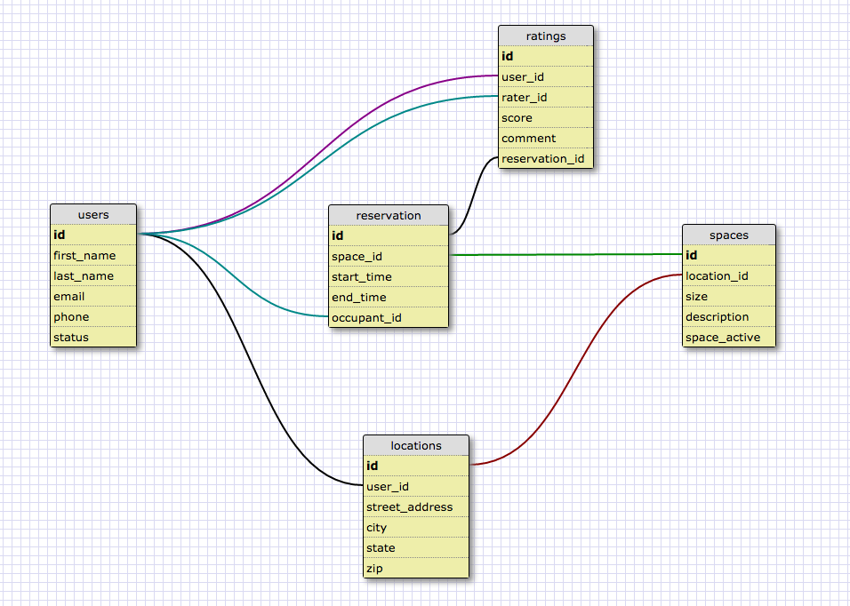

#SeeSpotGo

[SeeSpotGo](https://seespotgo.herokuapp.com)

##What is SeeSpotGo?

Everyone hates driving around in circles looking for parking, and when you do finally find a spot you're usually paying an exorbitant amount of money.  SeeSpotGo solves that problem by enabling users to both find available parking spots and rent out spots they own.  It's easy to sign up for and just as easy to find a spot (or rent out your spot and make some extra money!) You can also chat with other users to help find great deals in the area. 

Find a spot.  Park your car.  Get going!

##Contributing

- [Chelsey Lin](https://github.com/chelseylin)
- [Kelsey Edelstein](https://github.com/kedskeds)
- [Patrick Anderson](https://github.com/Pand0)
- [Conor Burke](https://github.com/conorburke)

##Configuration and Dependencies

* Rails version: 5.0.0.1
* Ruby version: 2.3.1
* Depolyment Server: Heroku
* Database: PostgreSQL v9.5.5 on x86_64-apple-darwin15.6.0
* Test Suite: RSpec (rspec-rails v3.5)
* Security: Devise v4.0
* Chat Server Development: Redis v3.2 
* Chat Server Production: RedisCloud
* Google Maps
* Geocoder

##Download

* Clone: git clone https://github.com/conorburke/SeeSpotGo.git

##Developing
To contribute towards SeeSpotGo, clone the repository, navigate to the directory, and follow these steps: 

1. Run `bundle install`
2. Run `rails db:create`
3. Run `rails db:migrate`
4. Run `rails db:seed` (this will populate the database with selected locations around the San Diego area)
5. Run `rails s` and the application will be running on your local server.  Simply navigate to `http://localhost:3000` in your browser to view the app.
6. To manage the database, run `rails c`

###Homescreen

###Map and Reservations

###Chat

###Model Schema

